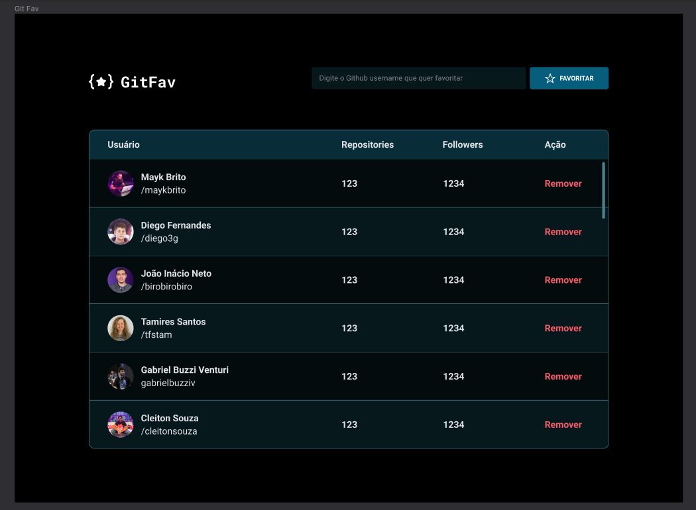

<h1 align="center"> Desafio GitFav 🌟</h1>

Bora praticar e se desafiar um pouquinho mais? 💜  
 
A ideia agora é criar o **GitFav**! 
 
Aqui está o <a href="https://www.figma.com/file/E8s4rYHfPhoctow5q0QIOd/Desafios-Explorer-GitFav-Copy-Copy?fuid=1283792090047540509">LINK</a> com o layout da aplicação. Ele abrirá um arquivo igual a imagem abaixo:

  

  <a href="#-tecnologias">Tecnologias</a>&nbsp;&nbsp;&nbsp;|&nbsp;&nbsp;&nbsp;

## 🚀 Tecnologias

Esse projeto foi desenvolvido com as seguintes tecnologias:

- HTML e CSS
- JavaScript
- Git e Github
- Figma

Feito com ♥ by Rocketseat :wave: [Participe da nossa comunidade!](https://discord.gg/rocketseat)
